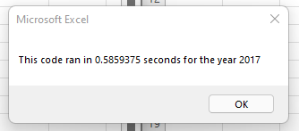
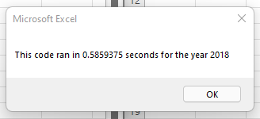

# stock-analysis


##Overview of Project
```
  The purpose of this project was to provide an analysis of stocks in 2017 and 2018. 
  The intent of this was to help Steve see the difference between the two years of stocks. 
  In addition to providing Steven with this information, the run time of the script was calculated to confirm efficiency.
```

##Results

  
  
  
##Summary
```
1. What are the advantages or disadvantages of refactoring code?
   - Advantages:
     - Faster processing time
   - Disadvantages:
     - Unknown
2. How do these pros and cons apply to refactoring the original VBA script?
   - Pros: 
     - Ability to processing larger amounts of data with a quicker processing time
   - Cons:
     - Unknown

